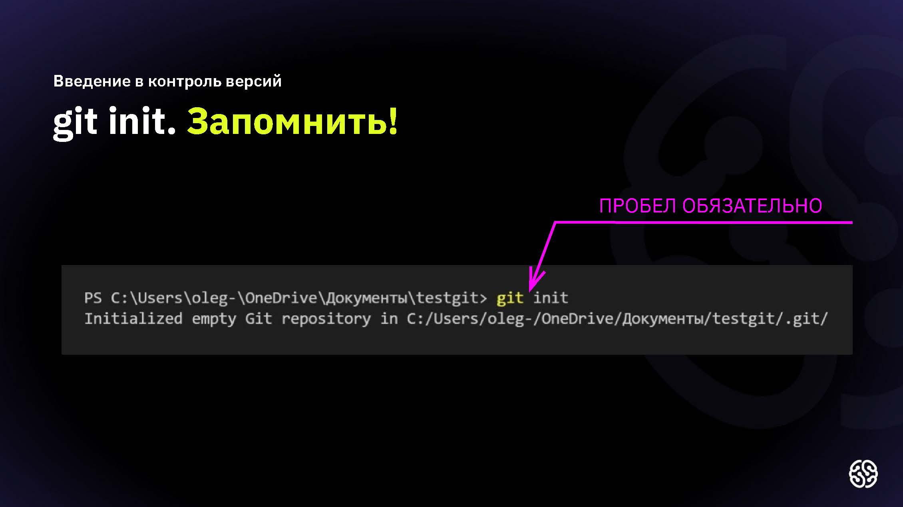
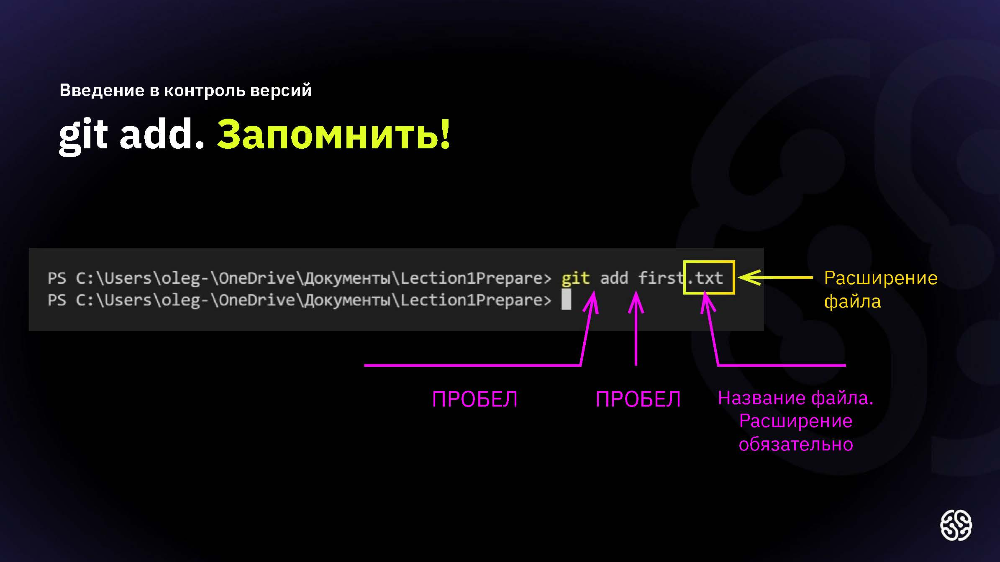
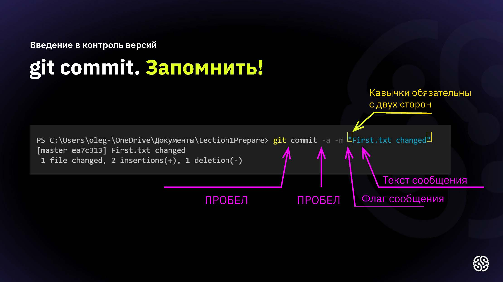
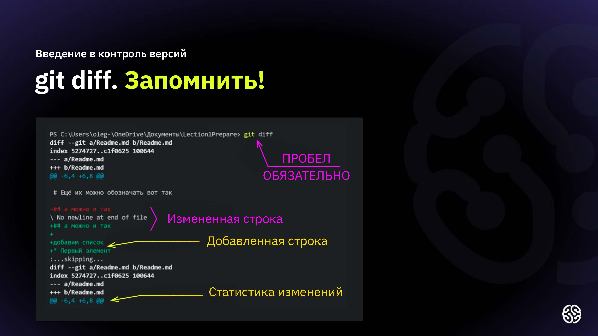
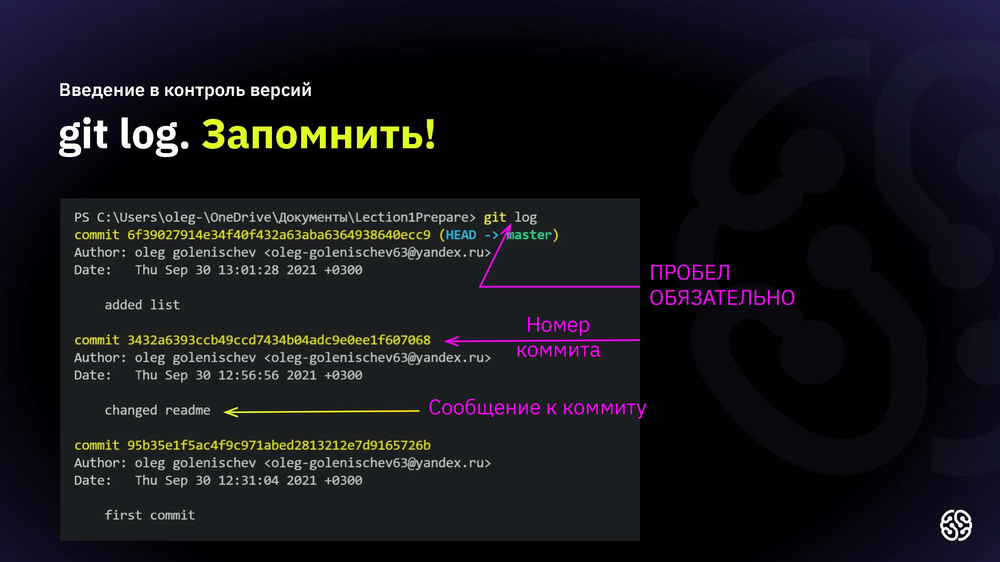

# Основные команды гит

**git int** - инициализация локального репозиторий

 

**git add "path"** - добавить файл или файлы к следующему коммиту 

**git add .** - добавить все файлы в проекте в отслеживание 

**git commit -m "message"** - создание коммита

**git commit -am "message"** - связка комманд git add и git commit *(Работает только после 1-го ручного добавления в отслеживание)*

**git diff** - просмотр разницы между текущим файлом и закоммиченным файлом

**git log** - вывод на экран всех коммитов с их хеш-кодами

**git checkout** - переход от одного коммита к другому

**git checkout master** - вернуться к актуальному состоянию и продолжить работу *(git checkout main)*

**git checkout _хеш-код_** - для перехода к определенному коммиту, необходимо ввести хеш-код коммита (достаточно ввести первые 4-6 цифр)

[Ссылка на Git для новичков часть 1](https://habr.com/ru/articles/541258/)

[Ссылка на Git для новичков часть 2](https://habr.com/ru/articles/542616/)

__git branch__ - просмотр всех веток 

**git branch _name_** - создание новой ветки 

**git checkout _branch_name_** - переход к выбранной ветке

**git merge _branch_name_** - слияние веток

**.gitignore** - создание файла для игнорирования не нужных файлов